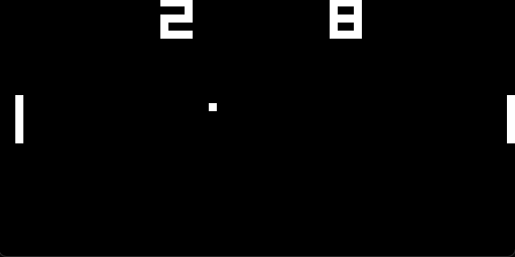

# CHIP-8-Emulator
A simple CHIP-8 emulator written in C++ using SDL3 for graphics and input handling. CHIP-8 is an interpreted programming language from the late 1970s.


This project includes a fully implemented CHIP-8 instruction set via [Cowgod's technical specs](http://devernay.free.fr/hacks/chip8/C8TECH10.HTM) and passes all opcode tests in the [Timendus test suite](https://github.com/Timendus/chip8-test-suite).

I began this project to explore emulation concepts and to get more comfortable with low level computing. My goal is to take what I've learned here to explore gameboy emulator development next. 





# Features and Specifications
- 4KB of memory
- 16 general purpose 8-bit registers, one 16 bit register, and two 8-bit sound and timer delay registers
- 16-bit program counter and 8-bit stack pointer
- 64x32 monochrome display
- 16-key hexadecimal keypad

# Keypad Layout
```
CHIP-8 Keypad    QWERTY Keyboard

  1 2 3 C          1 2 3 4
  
  4 5 6 D          Q W E R
  
  7 8 9 E          A S D F
  
  A 0 B F          Z X C V
```
# Running the Emulator
- Ensure the included SDL3.dll is present
- Open .ch8 files with the .exe or run it from the terminal:
```
./CHIP-8 Emulator.exe PONG.ch8
```


# TODO
- Implement sound
- Add config menu with customizable window size, colors, emu speed, and controls
- Implement functionality to open ROMs from within the program 

# Resources
http://devernay.free.fr/hacks/chip8/C8TECH10.HTM

https://tobiasvl.github.io/blog/write-a-chip-8-emulator/
